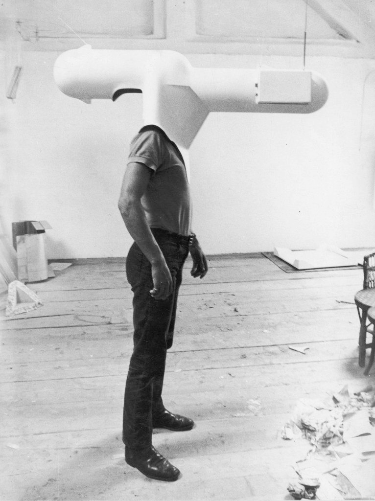
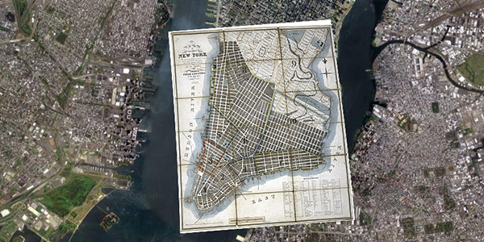

## IASC 2P02 Zachary Koroll
   

## My Biography  
 

My names Zachary Koroll I'm a fourth year IASC student graduating in the fall of 2018. I plan on focusing on GIS and the analysis of mapping information, using my knowledge in the field to analyze crimes and predict future crime based on the information at hand. My existing projects in IASC 2P02 may not display my skill level for my future endeavors but my work in IASC 2P07 displaying my capability of using high end mapping programs like ARC GIS to be used later in my career as a Police investigator. These programs take a high skill level to learn and using them properly will help advance me in my career in policing. My overall goal is to become a geographical analyzer for the police force or even the Canadian army. Being able to use programs like these will put me a step in the right direction in creating geographical patterns associated with crime, violence and even terrorism, allowing me to speed up the time it takes to solve a crime and prevent them in the future. I believe this to be a major role in modern day investigating and preventative tactics used by the police force and army and I believe in the near future I will be an asset graduating from an IASC major having previous experience with these programs. 

## Featured Project

 This Pecha Kucha tackled the work of Walter Pichler focusing on his Prototyping Escape where he displayed his TV Helmet/Portable Living Room and Small Room in 1967. What these two projects focused on was expressing what he believed to be the future of modern life in the future. His work was a early staged virtual reality set presenting the capability of creating a alternate reality within a wearable. After researching Walter it was understood he was potentially the first person to create the concept of virtual reality and brought it to life in his installations. His work was a parody emphasizing how people became reliant on technology and displayed how humans strive to achieve making tasks easier, having everything within reach. His tow 1967 installations depicted what we see today as virtual reality and after breaking it down to its most basic form function, they were essentially identical other than the advance gyroscopic motion sensors displayed in modern virtual reality. His goal was very similarl to virtual reality today was to take a user to a unique location escaping from their current location encapsuling them into a new universe, the technological universe. This is essentially the ancestor of Virtual reality an influence what we have available to us. Looking back in history this art installation originally used as a parody to display humanistic wants and needs had a major influence on what we see today in society. This does not only incorporate our need for escaping reality by using virtual reality, but also our reliance on technology itself. These changes can be seen in  

 Based on the instructors feed back, I lost engagement and focus on media archeology going through the history of my research project. I made an additional slide focusing on zombie media to bring the focus back in on where I was going with the history and why I brought it up. You can see the changes made by clicking the following link. <a href="https://github.com/zacharykoroll/IASC-2P02/commit/674175c4c3faeeebc1ac1ff602fba470ce830130#diff-890f068779e43beb317787310daafa5c"> [Click Here] </a>. Following this change I made another additional slide pertaining to bending circuitry by using media archeology to look at the changes made internally to the product but essentially keeping the general concept and idea the same click the link to see the following changes. <a href="https://github.com/zacharykoroll/IASC-2P02/commit/c14c235130b1a7f6d0c259ebaff993ccbc4ce0ef#diff-890f068779e43beb317787310daafa5c"> [Click Here] </a>. The final change I made to this Pecha Kucha was the addition of 3 more slides to tie everything together. These slides discussed Walter Pichler's idea as a gallery installation explaining how it never took off and was essentially over looked as a potential product. This was essential to the Pecha Kucha because many people were lost when I spoke of a art piece changing our current technologies on the market today. The final slide was used for a closing argument and more or less a conclusion recapping all of my main points explaining how it ties all together allowing me to close the gaps in my Pecha Kucha and make the information seem relevant in our time today. By clicking the following link it will show you the final Pecha Kucha showing what my new presentation will look like.<a href="https://github.com/zacharykoroll/IASC-2P02/commit/1ebcdbe884c3f1d70dc01c98df5cca633b09294a#diff-890f068779e43beb317787310daafa5c"> [Click Here] </a>.

<a href="https://zacharykoroll.github.io/IASC-2P02/reveal/index.html"> Pecha Kucha Link </a>

## Collaborative Project

 For my collaborative project I took part in working along side Anna, Gavin and Jimmy and we focused on Hypercities, which is a digital media learning tool that uses mapping and overlay function allowing a collaboration with the historical layers of a city. What it allows you to do is use coordinates to overlay maps onto modern maps or mapping systems like google earth allowing the comparison of the two maps. This digital media tool also has a collection of published historical material you can browse and go through looking at others findings.Throughout this collaborative project I was focused on the task at hand of finding research findings. My group assigned me the task to research what the general purpose of the project was, what its main feature's contained and background information on the creators and where it was produced. I approached this finding core resources through the main web page, but also through many academic resource's like Super Search from Brock Universities webpage. This is some of the information I contributed to our collaborative project<a href="https://github.com/IascAtBrock/IASC-2P02-TeamPresentations/blob/Team4/General%20Documents/zach%20findings"> [Click Here] </a>.

 
This helped enriched my thinking by learning to use academic sources and to post references and paraphrase the work before publishing to a webpage to avoid plagiarism.  We tackled this as a team communicating through our Github page for meeting times, this allowed us to have set times and places to meet and to finalize our project. This will help advance me in the future advancing my research agenda by completing good time management skills and communication skills. This collaborative project allowed me to listen to other peoples opinions and ideas expanding on them or reducing them to maintain the focus of the task. Although there were a few hiccups while completing this project as a group we proceeded to push through displaying an amazing presentation. This is will help me advance later in life having these core communication and time management skills allowing me to work effectively and exceed the expectations of the task at hand.   

   
<a href="https://docs.google.com/presentation/d/14dArW897tEvWuU2PMr2sL6Valei03PWGEuCuQIKrX8g/edit?usp=sharing"> Link to Presentation </a>

## Research Presentation
<a href="https://zacharykoroll.github.io/IASC-2P02/reveal/index.html"> Walter Pichler: Portable Living Room </a>

## Academic Blog

Following the reading of GRAPHS, MAPS, TREES by Franco Moretti, ... [continue reading](Blog)

