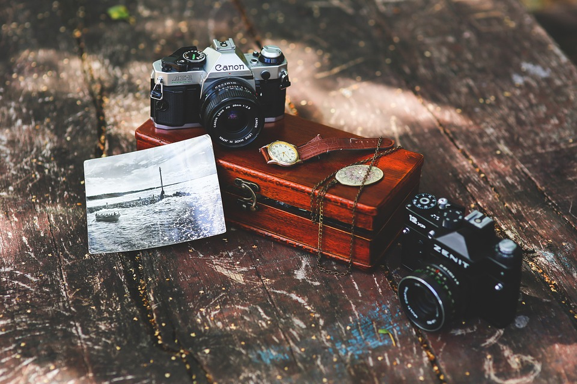

   

## My Biography  
 

My names Zachary Koroll I'm a fourth year IASC student graduating in the fall of 2018.  I plan on focusing on GIS and the analysis of mapping information, using my knowledge in the field to analyze crimes and predict future crime based on the information at hand. My existing projects in IASC 2P02 may not show display my skill level for my future endeavors but my work in IASC 2P07 displaying my capability of using high end mapping programs like ARC GIS to be used later in my career as a Police investigator. These programs take a high skill level to learn and using them properly  will help advance me in my  career in policing. My overall goal is to become a geographical analyzer for the police force or even the Canadian army. Being able to use programs like these will put me a step in the right direction in creating geographical patterns associated with crime, violence and even terrorism, allowing me to speed up the time it takes to solve a crime and prevent them in the future. I believe this to be a major role in modern day investigating and preventative tactics used by the police force and army and I believe in the near future I will be an asset graduating from an IASC major having previous experience with these programs. 

## Blog Post

Following the reading of GRAPHS, MAPS, TREES by Franco Moretti, ... [continue reading](Blog)

## Solo Presentation

 This Pecha Kucha tackled the work of Walter Pichler focusing on his Prototyping Escape where he displayed his TV Helmet/Portable Living Room and Small Room in 1967. What these two projects focused on was expressing what he believed to be the future of modern life in the future. His work was a early staged virtual reality set presenting the capability of creating a alternate reality within a wearable. After researching Walter it was understood he was potentially the first person to create the concept of virtual reality and brought it to life in his installations. His work was a parody emphasizing how people became reliant on technology and displayed how humans strive to achieve making tasks easier, having everything within reach. His tow 1967 installations depicted what we see today as virtual reality and after breaking it down to its most basic form function, they were essentially identical other than the advance gyroscopic motion sensors displayed in modern virtual reality. is goal very similarly to virtual reality today was to take a user to a unique location escaping from their current location encapsuling them into a new universe, the technological universe. This is essentially the ancestor of Virtual reality an influence what we have available to us. Looking back in history this art installation originally used as a parody to display humanistic wants and needs had a major influence on what we see today in society. This does not only incorporate our need for escaping reality by using virtual reality, but also our reliance on technology itself. These Cahnges can be seen in  

 Based on the instructors feed back I lost engagement and focus on media archeology Going through the history of my research project, I made an additional slide focusing on zombie media to bring the focus back in on where I was going with the history and why I brought it up . You can see the changes made by clicking the following link. [Click here]. Following this change I made another additional slide pertaining to bending circuitry by using media archeology to look at the changes made internally to the product but essentially keeping the general concept and idea the same click the link to see the following changes. [Click here]. The final change I made to this Pecha Kucha was the addition of 3 more slides to tie everything together. These slides discussed Walter Pichler's idea as a gallery installation explaining how it never took off and was essentially over looked as a potential product. This was essential in the Pecha Kucha because many people were lost when I spoke of a art piece changing our current technologies on the market today.  the final slide was used for a closing argument and more or less a conclusion recapping all of my main points explaining how it ties all together allowing me to close the gaps in my Pecha Kucha and make the information seem relevant in our time today. By clicking the following link it will show you the final Pecha Kucha showing what  my new presentation will look like.[click here].

<a href="https://zacharykoroll.github.io/IASC-2P02/reveal/index.html"> [ Pecha Kucha Link] </a>
